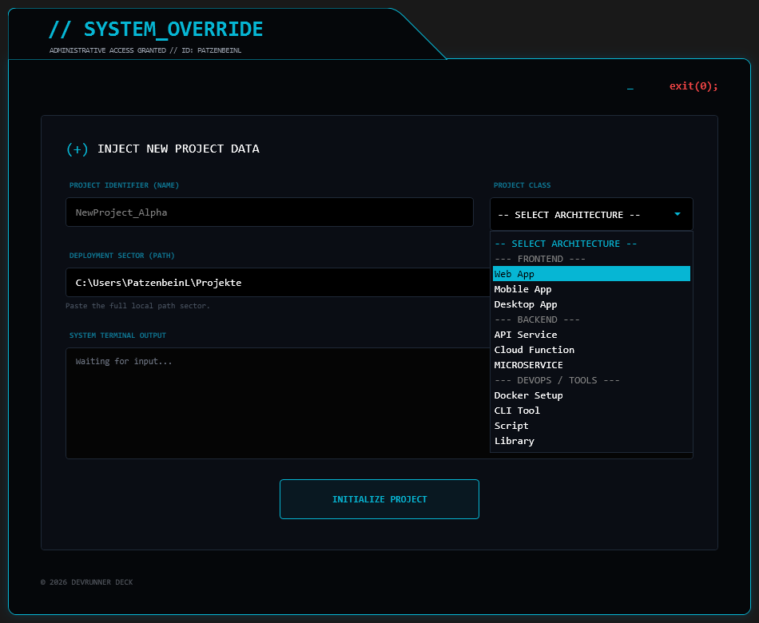
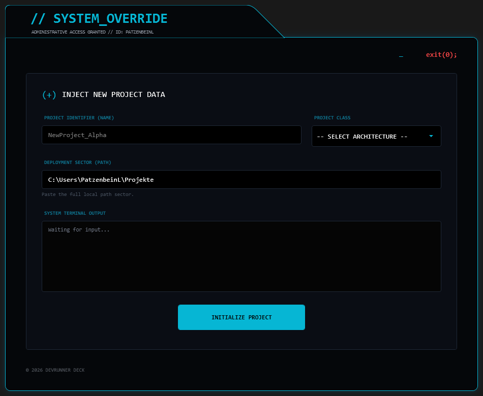
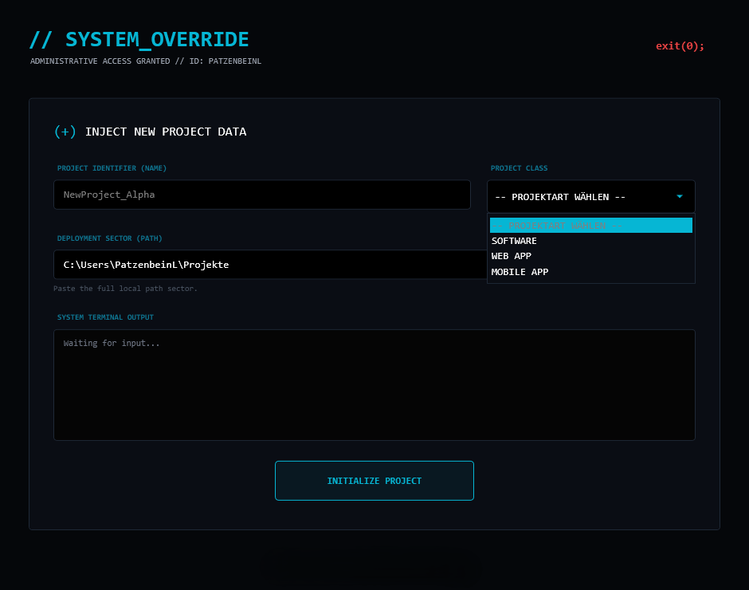
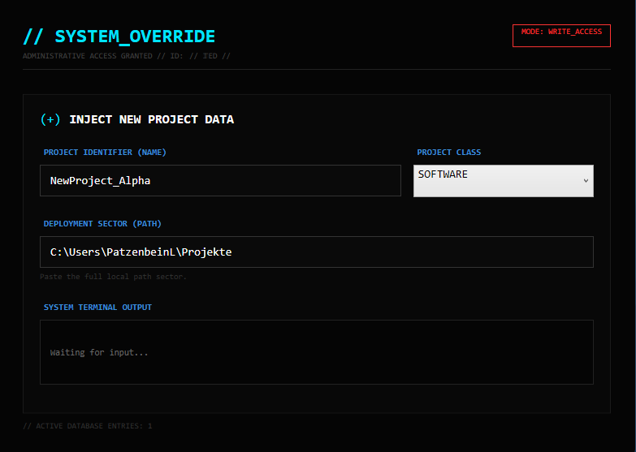
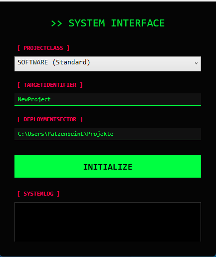
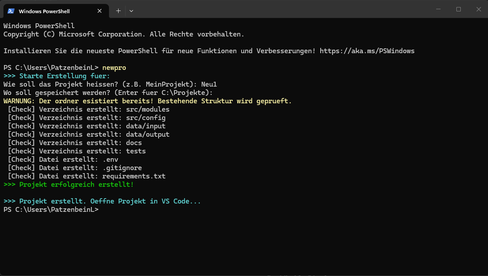

# DevRunner - Project Evolution

## v9.3: Modular Edition (Stable)
**Status:** Production Ready
Bereinigung der Codebasis und Fokus auf Kern-Funktionalität.
- **Refactoring:** Experimentelle Features (Grid/Container-Logik) wurden zugunsten der Stabilität entfernt (Rollback).
- **Architecture:** Sauberer Split zwischen GUI-Logik (XAML) und Backend-Funktionen.
- **Integration:** Optimierter Start-Prozess für VS Code und JetBrains IDEs.

---

## v7.0 - v9.2: Rapid Prototyping & UI Flow (Internal)
**Status:** Experimental / Closed
In dieser Phase fand eine intensive Weiterentwicklung der GUI (WPF) im "Flow-State" statt.
- **UI Experiments:** Diverse Iterationen am Cyberpunk-Design (Hex-Colors, Window-Shapes).
- **Win32 API:** Experimente mit `SetParent` für das Einbetten von Terminals (Grid-System).
- **Decision:** Das Grid-System wurde aufgrund von Komplexität und Zeitmanagement vorerst aus dem Stable-Branch entfernt.

---

## v6.0: Architecture Expansion
**Status:** UI Implementation
Erweiterung der Projektauswahl um spezifische Technologie-Stacks.
- **UI:** Implementierung von Kategorien im Dropdown-Menü.
- **Features:** Vorbereitung für Docker-Setups.

---

## v5.0: Production Polish
**Status:** Stable Release Candidate
Finalisierung des UI-Designs mit Fokus auf Konsistenz und User Experience.
- **Design:** Hinzufügen von feinen Rahmen (Borders) und Footer-Informationen.
- **UX:** Klare Platzhalter-Texte in Dropdowns.

---

## v4.0: The "Cyberpunk" Overhaul
**Status:** High-Fidelity UI
Kompletter Neuentwurf des Fensters ohne Standard-Windows-Rahmen (`WindowStyle="None"`).
- **Tech:** Nutzung von Custom Drawing Paths für das abgeschrägte Fenster-Design.
- **Style:** Einführung der Cyan/Black Farbpalette.

---

## v3.0: Branding & Identity
**Status:** Design Prototype
Erste Implementierung eines Logos und Status-Indikatoren.
- **Branding:** Einführung des "SYSTEM_OVERRIDE" Headers.
- **Logic:** Erste Versuche mit Status-Anzeigen.

---

## v2.0: WPF Integration
**Status:** MVP (Minimum Viable Product) - GUI
Der erste Schritt weg von der Konsole hin zu einer grafischen Oberfläche.
- **Tech:** Einbindung von XAML direkt in PowerShell.
- **Look:** Experimentelles "Hacker"-Design (High Contrast Green).

---

## v1.0: CLI Roots
**Status:** Proof of Concept
Das ursprüngliche Skript zur Automatisierung von Ordnerstrukturen.
- **Interface:** Reine Text-Konsole (PowerShell CLI).

