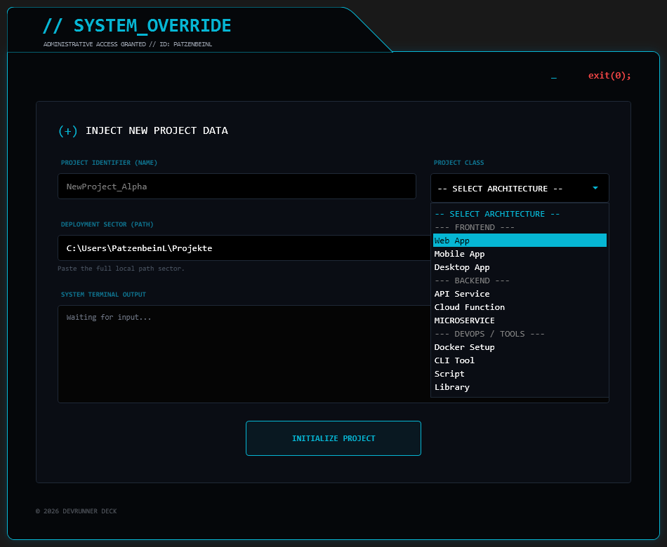

# DevRunner 🚀


**DevRunner** ist ein PowerShell-Automatisierungstool mit nativer WPF/XAML-Benutzeroberfläche. Es erstellt eine standardisierte Projektstruktur (*Scaffolding*) für neue Softwareprojekte, richtet Ordner und Konfigurationsdateien ein und bootet das Projekt direkt in der gewählten IDE (z. B. VS Code).



> 🎓 **Hinweis:** Dieses Tool wurde entwickelt, um den eigenen Entwickler-Workflow zu optimieren und tiefgreifendes Wissen in der Verbindung von PowerShell-Backend-Logik und XAML-Frontend-Design aufzubauen.

---

## ✨ Features

* **Grafisches UI (WPF):** Komplett eigenständiges Fenster-Design ohne Standard-Windows-Rahmen (Custom Drawing Paths, XAML).
* **Automatisierte Struktur:** Erstellt Verzeichnisse für Sourcecode (`src`), Tests, Dokumentation und Daten.
* **Boilerplate-Generierung:** Legt automatisch `.gitignore`, `.env`, `requirements.txt` und eine initiale `README.md` an.
* **Nahtloser Workflow:** Öffnet das fertige Projekt sofort in Visual Studio Code oder JetBrains IDEs.
* **Saubere Architektur:** Strikt getrennte Logik zwischen GUI-Rendering (XAML) und Backend-Funktionen (PowerShell).

---

## 📂 Erzeugte Projekt-Struktur

Jedes neue Projekt erhält automatisch diesen sauberen Aufbau:

```text
MeinProjekt/
├── src/
│   ├── modules/
│   └── config/
├── data/
│   ├── input/
│   └── output/
├── docs/
├── tests/
├── .env
├── .gitignore
├── requirements.txt
└── README.md
````

---

## ⚙️ Installation & Einrichtung

Um DevRunner komfortabel als globalen Befehl (Alias) nutzen zu können:

### 1. Skript ablegen

Speichere das Projekt in deinem Tools-Verzeichnis ab:

**Pfad:**
`C:\Users\DEIN_USER\Tools\DevRunner\`

---

### 2. PowerShell Profil konfigurieren

Öffne dein PowerShell-Profil:

```powershell
code $PROFILE
```

---

### 3. Alias erstellen

Füge folgenden Code hinzu, um den DevRunner aus jedem Terminal heraus starten zu können:

```powershell
Set-Alias -Name 'newpro' -Value "C:\Users\DEIN_USER\Tools\DevRunner\START.vbs" # Pfad ggf. anpassen
```

---

### 4. Nutzung

Lade das Terminal neu und tippe den Alias ein. Das DevRunner UI öffnet sich sofort:

```powershell
newpro
```

---

## 📈 Project Evolution (Vom Skript zur App)

DevRunner hat sich von einem simplen CLI-Skript zu einer vollwertigen Desktop-Oberfläche entwickelt. Dieser Verlauf spiegelt meinen Fokus auf kontinuierliche UI/UX-Verbesserung wider:

**v5.0: Production Polish**
Finalisierung des UI-Designs mit Fokus auf Konsistenz, User Experience und klaren Status-Indikatoren.

**v3.0: Branding & Identity**
Einführung des Cyberpunk-Designs, "SYSTEM_OVERRIDE"-Headers und ersten Status-Anzeigen.

**v2.0: WPF Integration (MVP)**
Der erste Schritt weg von der reinen Konsole hin zur Einbindung von XAML direkt in PowerShell.

**v1.0: CLI Roots (Proof of Concept)**
Das ursprüngliche Skript zur Automatisierung der reinen Ordnerstrukturen im Terminal.

---

## 📝 Voraussetzungen

* **PowerShell:** Version 5.1 oder neuer.
* **Execution Policy:** Muss das Ausführen von Skripten erlauben
  (`Set-ExecutionPolicy RemoteSigned -Scope CurrentUser`).

---

## ⚖️ Lizenz

Dieses Projekt ist unter der MIT License lizenziert.

